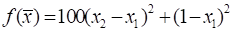
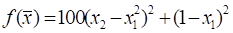

# Лабораторные работы по дисциплине "Методы оптимизации" на факультете ФПМИ, НГТУ

### Папки:
### 1. Методы одномерного поиска
> Реализовать методы дихотомии, золотого сечения, исследовать их сходимость и провести сравнение по числу вычислений функции для 
достижения заданной точности **eps** от **10^(-1)** до **10^(-7)**.  
>Построить график зависимости количества вычислений минимизируемой функции от десятичного логарифма задаваемой точности.  
>Реализовать алгоритм поиска интервала, содержащего минимум функции. Реализовать метод Фибоначчи, сравнить его с методами дихотомии и 
золотого сечения.  
>Задачу выполнять для функции: **f(x) = (x - 2)^2, x ϵ [-2, 20]**.

### 2. Методы спуска (0-го, 1-го и 2-го порядка и переменной метрики)
> Реализовать два метода поиска экстремума функции: **метод Розенброка**, **метод Бройдена**. Включить в реализуемый алгоритм собственную процедуру, реализующую одномерный поиск по направлению.  
> С использованием разработанного программного обеспечения исследовать алгоритмы на квадратичной функции , функции Розенброка  и на заданной в соответствии с вариантом тестовой функции, осуществляя спуск из различных исходных точек (не менее двух). Исследовать сходимость алгоритма, фиксируя точность определения минимума/максимума, количество итераций метода и количество вычислений функции в зависимости от задаваемой точности поиска. Результатом выполнения данного пункта должны быть выводы об объёме вычислений в зависимости от задаваемой точности и начального приближения.  
>
> Построить траекторию спуска различных алгоритмов из одной и той же исходной точки с одинаковой точностью. В отчете наложить эту траекторию на рисунок с линиями равного уровня заданной функции. 
>
> Результат работы должен содержать:
> * таблицы с результатами проведенных исследований, где должны быть отражены начальное приближение **x0**, задаваемая точность по функции и переменным **(eps от 10^(-3) до 10^(-7))**, количество итераций, число вычислений целевой функции, найденная точка и значение функции в ней.
> * для каждой целевой функции при точности поиска по переменным и функции **eps = 0.001** и одной начальной точке составить следующую таблицу
>
> |  i  | (xi, yi)  | f(xi, yi) | (S1, S2) | lambda | xi - xi-1 | yi - yi-1 | fi - fi-1 | grad(f) | A |
> |:---:|:---------:| :--------:|:--------:|:------:|:---------:|:---------:|:---------:|:-------:|:-:|
> |  1  |           |           |          |        |           |           |           |         |   |
> |  2  |           |           |          |        |           |           |           |         |   |
> | ... |           |           |          |        |           |           |           |         |   |
